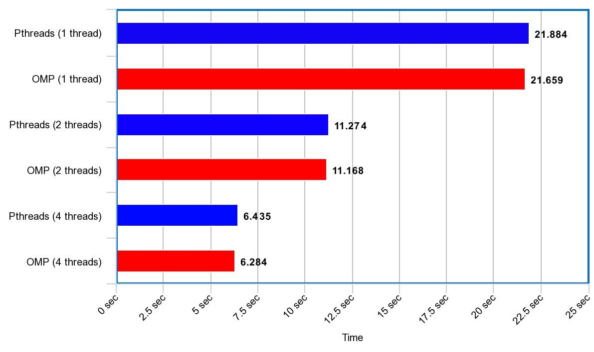
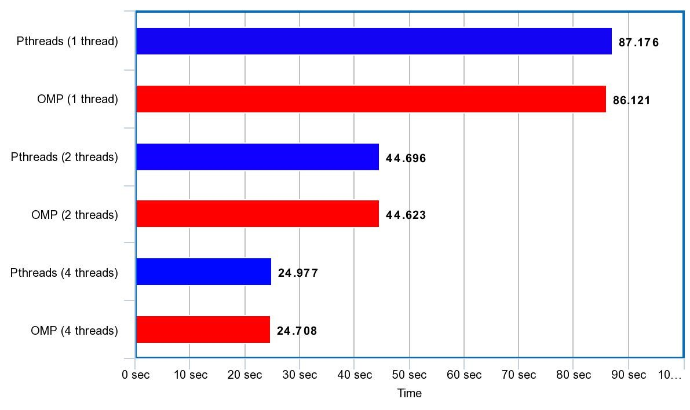

# T2: Programação Paralela Multithread 

Nome: Crístian Marcos Weber

Disciplina: Programação Paralela

Informações adicionais encontradas em [specs.txt](specs.txt) e [results.csv](results.csv)

## Parte I: Pthreads

1.
  - Particionamento: O particionamento acontece quando cada thread determina a sessão do vetor em que irá realizar os cálculos a partir de um argumento 'i' de offset recebido, o qual é
usado para determinar o começo da partição, e definir o fim da partição de acordo com o 'wsize'.

```
void *dotprod_worker(void *arg)
{
   ...
 
   int wsize = dotdata.wsize;
   int start = offset*wsize;
   int end = start + wsize;
```

  - Comunicação: Devido à natureza do problema, não há comunicação direta entre as threads, porém todas realizam acesso à mesma variável global de resultado final para realizar a soma de
seus resultados parciais.

```
   pthread_mutex_lock (&mutexsum);
   dotdata.c += mysum;
   pthread_mutex_unlock (&mutexsum);
```

  - Aglomeração: A aglomeração ocorre no trecho de código abaixo, na realização de somas parciais, diminuindo a eventual disputa pela variável resultante final da execução.

```
   mysum = 0.0;
   for (i = start; i < end ; i++)  {
       mysum += (a[i] * b[i]);
   }
```

  - Mapeamento: O mapeamento ocorre com balanceamento de carga estático (1/nthreads), com cada thread recebendo a mesma quantidade de elementos do vetor .


2. tempo sequencial = 11006402 usec

    tempo paralelo(2) = 5666549 usec
    
    speedup(2) = 1.942346

3. A partir dos testes realizados variando o wsize e o número de repetições, em cenários de execução sequencial ou paralela com 2 ou 4 threads, notou-se um speedup
consistente de aproximado ao apresentado na questão anterior ao passar de sequencial para 2 threads, enquanto, porém, houve queda na aceleração ao passar de 2 threads para 4 threads,
com o speedup caindo para números entre 1.65 e 1.78 em todos os cenários testados.

4. Os dados coletados e utilizados para as seguintes tabelas se encontram em 'results.csv'.

#### Tabela de speedup para execuções com vetor de tamanho 1000000.

| Nthreads inicial |  Nthreads final |  Repetições |  Speedup      | 
|------------------|-----------------|-------------|---------------| 
| 1                | 2               | 1000        | 1.9286586798  | 
| 2                | 4               | 1000        | 1.71527427129 | 
| 1                | 4               | 1000        | 3.30817861155 | 
| 1                | 2               | 2000        | 1.94234656755 | 
| 2                | 4               | 2000        | 1.67641393413 | 
| 1                | 4               | 2000        | 3.25617685075 | 
| 1                | 2               | 4000        | 1.94107831298 | 
| 2                | 4               | 4000        | 1.75180075606 | 
| 1                | 4               | 4000        | 3.40038245624 | 


#### Tabela de speedup para execuções com vetor de tamanho 4000000.
  
| Nthreads inicial |  Nthreads final |  Repetições |  Speedup      | 
|------------------|-----------------|-------------|---------------| 
| 1                | 2               | 1000        | 1.93436950764 | 
| 2                | 4               | 1000        | 1.65493510773 | 
| 1                | 4               | 1000        | 3.20125600952 | 
| 1                | 2               | 2000        | 1.92758096086 | 
| 2                | 4               | 2000        | 1.74403951856 | 
| 1                | 4               | 2000        | 3.36177737098 | 
| 1                | 2               | 4000        | 1.94876913196 | 
| 2                | 4               | 4000        | 1.76026129695 | 
| 1                | 4               | 4000        | 3.43034287967 | 


#### Tabela de speedup para execuções com vetor de tamanho 4000000.

| Nthreads inicial |  Nthreads final |  Repetições |  Speedup      | 
|------------------|-----------------|-------------|---------------| 
| 1                | 2               | 1000        | 1.93830750513 | 
| 2                | 4               | 1000        | 1.69026773968 | 
| 1                | 4               | 1000        | 3.2762586455  | 
| 1                | 2               | 2000        | 1.94181123126 | 
| 2                | 4               | 2000        | 1.75177915385 | 
| 1                | 4               | 2000        | 3.40162443564 | 
| 1                | 2               | 4000        | 1.95041674867 | 
| 2                | 4               | 4000        | 1.78948660336 | 
| 1                | 4               | 4000        | 3.49024464272 | 

5. O código em [pthreads_dotprod2.c](pthreads_dotprod/pthreads_dotprod2.c) não utiliza de exclusão mútua na região crítica onde é feito a adição das somas parciais no resultado final do produto escalar.
A falta do uso desse artifício pode ocasionar em um resultado incorreto se duas ou mais threads realizarem o acesso ao mesmo tempo, desde que uma realiza a escrita durante
o período entre a leitura e escrita de outra thread sobre a mesma variável.

## Parte II: OpenMP

Os gráficos abaixo comparam o tempo de execução do código [pthreads_dotprod.c](pthreads_dotprod/pthreads_dotprod.c) disponibilizado e do código [omp-dotprod.c](openmp/omp-dotprod.c) implementado utilizando OpenMP. As informações apresentadas são referentes a execuções com 4000 repetições. Como pode ser observado, a diferença entre os tempos de execução das duas implementações é quase nula, porém vale ressaltar que a implementação em OpenMP apresentou um tempo pouco menor em todos os testes realizados.

#### Tempo x Nthreads para 1 milhão de elementos totais
  

#### Tempo x Nthreads para 2 milhões de elementos totais
  
  
#### Tempo x Nthreads para 4 milhões de elementos totais
  
